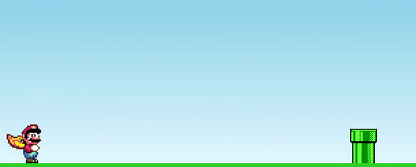

<h1 align='center'>
  
Mario Jump!

  
</h1>

<h1>
  <a href="https://tiheitords.github.io/MarioJump/">Iniciar jogo!</a>
</h1>

## Sobre

O seguinte projeto trata-se de um jogo simples feito com base no código do canal [Manual do Dev](https://www.youtube.com/c/ManualdoDev). Pressionando qualquer tecla do seu teclado, faça seu personagem pular e evitar os osbtáculos. Para recomeçar o jogo, basta recarregar a página.

## Tecnologias usadas

O jogo foi feito com as seguintes tecnologias:

- HTML
- CSS
- JavaScript
